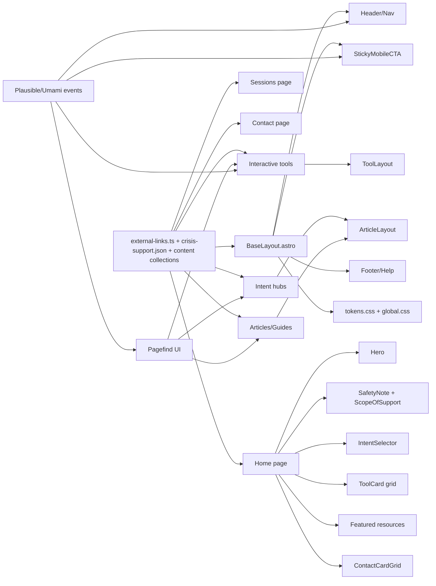

# Healing Souls 2.0 Implementation Blueprint

## Executive summary

Healing Souls 2.0 should be built as a static, content-first wellness website that feels closer to a boutique editorial self-help brand than a template “coach” page: visually rich, calm, premium, and high-trust, with one dominant conversion path to urlTopmateturn0search7 for booking and clean redirect paths to urlInstagramturn3search1, email, and urlWhatsApp click to chatturn3search0 for contact. The strongest implementation fit is urlAstroturn11search0 deployed to urlGitHub Pagesturn18search20, because Astro is explicitly optimized for content-driven sites, supports file-based routing, content collections, Markdown/MDX authoring, image handling, and has a first-party deployment guide for GitHub Pages. GitHub Pages supports custom workflows, custom domains, and HTTPS enforcement, which matches the requirement for Git-based publishing and static hosting. citeturn11search0turn14search1turn12search3turn18search20turn24search1turn11search11

The experience should revolve around four user jobs: understand whether this space is trustworthy; quickly decide whether to book a session; get immediate value from light self-help tools; and browse high-quality intent-led resources such as stress, overthinking, boundaries, burnout, sleep, and loneliness. This structure is consistent with the way official mental-wellbeing platforms such as urlEvery Mind Mattersturn9search3, urlHeadspaceturn9search0, and urlCalmturn9search1 organise support around practical self-help, sleep, stress, anxiety, and guided tools rather than a generic blog dump. citeturn9search3turn9search7turn9search11turn9search18turn9search0turn9search1

The recommended baseline stack is below.

| Layer | Recommended choice | Why it fits this project |
|---|---|---|
| Static site shell | urlAstroturn11search0 | Best fit. Content-driven, file-based routing, content collections, islands architecture for selective hydration, and built-in image tooling. citeturn11search0turn13search1turn14search1turn12search3 |
| Fallback option | urlEleventyturn0search6 | Good if the site becomes mostly editorial and almost no client interactivity is needed. Simpler, but less batteries-included than the recommendation above. citeturn0search6turn0search14turn13search3turn13search7 |
| Minimalist alternative | urlViteturn13search8 + hand-rolled static pages | Use only if scope is reduced to a landing page plus a few tools. Not ideal for a rich editorial/resource site with growing content. citeturn13search8turn13search4turn27search1 |
| Search | urlPagefindturn11search2 for site search, urlFuse.jsturn4search2 for tiny in-page datasets | Pagefind is fully static and infrastructure-free for blog/resources search; Fuse.js is great for prompt decks or small local datasets. citeturn11search2turn11search5turn11search12turn4search2turn4search6 |
| Interactivity and motion | Native CSS + urlMotionturn4search8 where needed | Use CSS first; use Motion only for premium micro-motion and scroll choreography. It has a tiny HTML/SVG variant and avoids heavy framework overhead. citeturn4search0turn4search8turn1search2 |
| Lightweight state | Vanilla JS first, then urlAlpine.jsturn4search5 only where markup-bound state helps | Alpine is minimal and works directly in markup, which suits static pages and tiny tools. citeturn4search1turn4search5turn4search9 |
| Analytics | urlPlausible Analyticsturn6search8 preferred; urlUmamiturn6search16 as alternative | Both are privacy-forward and event-capable; that matters for a mental-health-adjacent site where trust is part of the product. citeturn6search0turn6search8turn6search12turn6search9turn6search13 |
| Hosting and deploy | urlAstro GitHub Pages guideturn27search0 on top of urlGitHub Actionsturn18search12 | Matches static hosting, Git-driven updates, custom domain later, and no backend requirement. citeturn30view0turn24search1turn18search12turn11search1turn11search11 |

The homepage should expose content in this order: premium hero, trust and safety notice, quick intent selector, featured tools, “how sessions work,” featured articles/resources, testimonials/social proof if real and permissioned, and a persistent contact/book block. That order reduces bounce, front-loads trust, and matches the intent-led structure used by official self-help products. citeturn9search3turn9search7turn9search15turn9search18

Recommended route map:

```mermaid
flowchart TD
  Home["/"] --> About["/about"]
  Home --> Sessions["/sessions"]
  Home --> Tools["/tools"]
  Home --> Resources["/resources"]
  Home --> Contact["/contact"]
  Home --> Legal["/legal"]

  Tools --> Breathe["/tools/breathe"]
  Tools --> Ground["/tools/ground"]
  Tools --> CheckIn["/tools/check-in"]
  Tools --> Journal["/tools/journal"]
  Tools --> Cards["/tools/cards"]
  Tools --> Ritual["/tools/ritual-builder"]

  Resources --> Blog["/resources/blog"]
  Resources --> Hubs["/resources/hubs"]
  Resources --> Guides["/resources/guides"]
  Resources --> Search["/search"]

  Hubs --> Overthinking["/resources/hubs/overthinking"]
  Hubs --> Burnout["/resources/hubs/burnout"]
  Hubs --> Boundaries["/resources/hubs/boundaries"]
  Hubs --> Sleep["/resources/hubs/sleep"]
  Hubs --> Loneliness["/resources/hubs/loneliness"]
  Hubs --> Overwhelm["/resources/hubs/overwhelm"]

  Sessions --> Book["Topmate external link"]
  Contact --> Insta["Instagram external link"]
  Contact --> Mail["mailto external link"]
  Contact --> WA["WhatsApp external link"]

  Legal --> Disclaimer["/legal/disclaimer"]
  Legal --> Privacy["/legal/privacy"]
```



## Trust and safety

**Goals**

The site has to feel safe before it feels premium. That means the copy, structure, and interaction model should immediately answer who this is for, what kind of support is being offered, what the limits are, how urgent cases should get help, and how personal data is handled. Official public mental-health resources consistently foreground urgent-support pathways and practical next steps for people who feel unable to cope, and that pattern should be mirrored here. citeturn9search3turn2search2turn2search3turn2search12

**Acceptance criteria**

- A visible but non-alarmist safety note appears on the homepage, every tool page, and every article page.
- The site clearly states whether the offering is counselling, coaching, guided reflection, or educational support, and it must match the provider’s verified credentials and scope.
- “Book a session” never behaves like checkout; it always redirects to urlTopmateturn0search7.
- A crisis/help block is always reachable from header or footer in the same relative place across pages, matching the spirit of WCAG consistent-help guidance. citeturn21search4
- Any journal, mood, or ritual data is explicitly local-only unless the product later adds a real privacy-reviewed backend. The browser storage model can support this, but the UI must include “saved only on this device” and “clear data” controls. citeturn16search1turn16search5turn16search21
- The site includes `Organization`, `WebSite`, and `Article` structured data plus open graph metadata for social previews and discoverability. citeturn14search3turn14search7turn14search10turn14search2
- No page implies emergency support, diagnosis, medical treatment, guaranteed outcomes, or crisis intervention. Official advice should always point people to urgent support when appropriate. citeturn2search2turn2search3turn2search12turn2search16

**Step-by-step implementation tasks for the AI agent**

1. Create `src/data/crisis-support.json` with at least two records: default support for entity["country","India","south asia"] via urlTele-MANASturn2search3 and an optional record for the entity["country","United States","north america"] via url988 Lifelineturn2search6. Add a manual region toggle rather than IP geolocation in v1. citeturn2search3turn2search6  
2. Build a persistent `SafetyNote.astro` component used on homepage, tools, blog/article templates, and contact page.
3. Build a `ScopeOfSupport.astro` block containing: “What this space helps with,” “What this space is not for,” and “When to seek urgent help.”
4. Build a `CredentialsAndApproach.astro` block with fields for photo, qualifications, training, approach, languages, session format, and scope.
5. Add `src/pages/legal/disclaimer.astro` and `src/pages/legal/privacy.astro`; link both from footer and trust card areas.
6. Add structured data in `BaseLayout.astro`: `Organization`, `WebSite`, `Article` where relevant, plus open graph tags per page.
7. Use semantic landmarks—`<header>`, `<nav>`, `<main>`, `<footer>`, and `<address>` for contact details—so assistive tech can navigate quickly. citeturn15search19turn15search3turn15search7turn3search11
8. If any reflective tool stores user state, implement local-only persistence with a visible reset control and no silent analytics based on entered text. Use event counts only, never content capture. citeturn16search1turn16search5turn6search12turn6search13

**Recommended stack and patterns**

Use native HTML semantics, Astro layouts, JSON data files, and browser-local storage only for explicitly local tools. Use `<details>/<summary>` for FAQs and trust disclosures where possible, and `<dialog>` only for controlled modal interactions such as “How to use this tool” or a desktop contact sheet. These native elements reduce dependency risk and are broadly supported. citeturn15search2turn15search1turn15search9

**Accessibility checks**

- Safety/help links should be keyboard reachable within the first tab stops.
- The help mechanism should sit in the same relative order on all pages. citeturn21search4
- Buttons and contact targets should be at least 24 by 24 CSS pixels or satisfy spacing exceptions. citeturn29view0turn29view2
- Focus indicators must be visible and never obscured by sticky UI. citeturn1search0turn1search7
- Avoid drag-only interactions in tools; if a card deck or slider exists, provide a tap/click alternative. citeturn21search2

**Analytics and events to track**

Track only structural behaviour: `trust_notice_view`, `crisis_help_click`, `credentials_expand`, `scope_expand`, `privacy_view`, `disclaimer_view`, and `book_after_trust_click`. If using urlPlausible Analyticsturn6search8, wire these as custom events; if using urlUmamiturn6search16, use its tracker/event APIs. Avoid session replay in v1. citeturn6search12turn6search13turn6search24

**Example references**

Look at the urgent-support framing and intent-led self-help pathways on urlEvery Mind Mattersturn9search3, the visible support and clear therapist framing on urlBetterHelpturn9search2, and the direct crisis-support language on urlTele-MANASturn2search3 and url988 Lifelineturn2search6. citeturn9search3turn9search2turn2search3turn2search6

**Sample copy**

> Healing Souls offers guided sessions, reflective tools, and educational resources.  
> It is not emergency, crisis, or medical care.  
> If you feel at immediate risk or unable to keep yourself safe, contact urgent local support now.

> Saved only on this device. You can clear this journal at any time.

**Design-token examples for trust UI**

```css
:root {
  --trust-bg: #f7f4ee;
  --trust-border: #d8cdc0;
  --trust-ink: #2b2621;
  --trust-muted: #6f665e;
  --trust-accent: #7b8e7c;
  --danger-soft: #f7e7e7;
  --danger-ink: #7a3030;
  --radius-trust: 20px;
}
```

**Testing checklist**

- Verify every page contains emergency/help access.
- Verify all crisis-copy variants render correctly on mobile.
- Verify no entered journal text is sent in analytics payloads.
- Verify local-only tools survive refresh and can be cleared.
- Verify structured data appears per template.
- Verify keyboard-only flow can reach support, book, and contact actions without confusion.

## Premium aesthetic system

**Goals**

The site should feel premium, soft, and intentional without drifting into cliché “wellness template” territory. The design north star is calm editorial luxury: the restraint of urlAesopturn10search0, the spacing discipline of urlApple Indiaturn10search2, and the emotionally legible wellness framing of urlHeadspaceturn9search0 and urlCalmturn9search1. The result should feel tactile and rich through typography, spacing, layered surfaces, quiet motion, and thoughtful art direction, not through flashy gradients or heavy 3D clutter. citeturn10search0turn10search2turn9search0turn9search1

**Acceptance criteria**

- A single design-token file governs colours, typography, spacing, radii, shadows, motion timing, and surface elevations.
- The site uses at most two font families: one serif voice and one sans voice.
- Motion is subtle, low-amplitude, and optional under reduced-motion preferences.
- Every card, section shell, button, and article block looks visually related.
- The hero, tools, and article pages all feel like one brand system, not three different templates.
- Photography, illustrations, and SVG backgrounds follow one art-direction rule set.

**Step-by-step implementation tasks for the AI agent**

1. Create `src/styles/tokens.css` with colour, type, spacing, radius, shadow, z-index, and motion tokens.
2. Create `src/styles/theme.css` with light theme first; dark theme optional only after light mode is polished.
3. Build a design system inventory: `Hero`, `IntentCard`, `ToolCard`, `ArticleCard`, `TrustCard`, `QuoteCard`, `ContactCard`, `StickyCTA`, `TestimonialCard`, `SectionHeader`, `PillTag`.
4. Define one premium art direction for imagery: abstract organic SVG shapes, either muted illustration or real photography, but not both mixed randomly.
5. Use graphical resources that are easy to recolour and optimise: SVG first, compressed AVIF/WebP for any photo.
6. Restrict motion to entrance fades, parallax-light drift, button hover elevation, card reveal, and breathing-style circular scaling. No dramatic scroll hijacking.
7. Add motion tokens and a reduced-motion stylesheet using the browser preference media feature. citeturn1search2turn1search9
8. Create a reusable “surface recipe” system: plain surface, tinted surface, elevated surface, and glass-lite surface. Use transparency sparingly for readability. citeturn1search15

**Library trade-off table for motion and polish**

| Option | Use it for | Trade-off |
|---|---|---|
| Native CSS | Default transitions, hover, fade, scale, accordions | Cheapest and fastest. Start here. Combine with reduced-motion rules. citeturn1search2turn15search2 |
| urlMotionturn4search8 | Premium micro-motion, SVG draws, scroll-triggered reveals | Best default library here; official docs note a tiny mini HTML/SVG version. citeturn4search0turn4search8 |
| urlGSAPturn5search3 | Only if the site later needs complex choreography or storytelling animations | Powerful, but heavier and easier to overuse for a static wellness site. citeturn5search3turn5search15turn5search24 |
| urlLottieFiles Developer Portalturn4search7 | Hero accents, empty states, one-off decorative loops | Useful when animation is pre-made, but keep files few and opt out on reduced-data/reduced-motion. citeturn4search3turn4search7turn1search19turn1search2 |

**Graphics and animation resources**

For icons, use urlLucideturn7search3 because the official site emphasises lightweight, scalable, tree-shakable SVGs. For illustrations, start with urlStorysetturn7search0 and urlunDrawturn7search5 because both offer customisable illustration systems suited to recolouring. For background shapes and abstract organic assets, use urlHaikeiturn7search2. For photography, use urlUnsplashturn8search0 or urlPexelsturn8search1 very sparingly, and only if the imagery matches the premium restraint of the brand. For supplemental SVG assets, use urlSVG Repoturn8search3. citeturn7search3turn7search0turn7search5turn7search2turn8search0turn8search1turn8search3

**Example references**

Use urlAesopturn10search0 for calm luxury and editorial restraint, urlApple Indiaturn10search2 for spacing, hierarchy, and premium product storytelling, and urlHeadspaceturn9search0 plus urlCalmturn9search1 for emotionally legible self-help framing. citeturn10search0turn10search2turn9search0turn9search1

**Sample copy**

> A softer place to pause, breathe, and come back to yourself.

> Guided sessions, thoughtful tools, and gentle resources for the days that feel heavy.

**Design-token example**

```css
:root {
  --bg: #f4efe8;
  --surface: #fbf8f4;
  --surface-tint: #f1ede7;
  --ink: #211d1a;
  --muted: #6d665f;

  --sage-500: #7b8d7d;
  --mauve-500: #877391;
  --gold-500: #b79860;
  --rose-300: #dcb7b3;

  --font-serif: "Newsreader", Georgia, serif;
  --font-sans: Inter, system-ui, sans-serif;

  --space-2: .5rem;
  --space-4: 1rem;
  --space-6: 1.5rem;
  --space-8: 2rem;
  --space-12: 3rem;

  --radius-card: 24px;
  --radius-pill: 999px;

  --shadow-soft: 0 12px 30px rgba(33, 29, 26, .08);
  --shadow-lux: 0 24px 60px rgba(33, 29, 26, .12);

  --ease-premium: cubic-bezier(.22,1,.36,1);
  --dur-fast: 180ms;
  --dur-mid: 320ms;
}
```

**Sample wireframe**

```text
┌──────────────────────────────────────────────────────────────────────┐
│ Healing Souls                                      Book on Topmate  │
│ About  Sessions  Tools  Resources  Contact                           │
├──────────────────────────────────────────────────────────────────────┤
│ Safety note: Not crisis care • Need urgent support? See help now     │
├──────────────────────────────────────────────────────────────────────┤
│ H1: A softer place to pause, breathe, and begin again                │
│ Subcopy: Guided sessions, self-help tools, thoughtful resources      │
│ [Book a session] [Explore tools]                          [Hero art]  │
├──────────────────────────────────────────────────────────────────────┤
│ Quick paths                                                          │
│ [I’m overwhelmed] [I’m overthinking] [I need boundaries] [Sleep]    │
├──────────────────────────────────────────────────────────────────────┤
│ Featured tools         │ How sessions work                           │
│ Breathe                │ What to expect                              │
│ Ground                 │ Who it’s for                                │
│ Journal                │ Book on Topmate                             │
├──────────────────────────────────────────────────────────────────────┤
│ Featured articles / guides                                            │
├──────────────────────────────────────────────────────────────────────┤
│ Contact cards: WhatsApp • Instagram • Email                           │
└──────────────────────────────────────────────────────────────────────┘
```

**Accessibility checks**

- Respect `prefers-reduced-motion`; decorative motion must be removable. citeturn1search2turn1search9
- Maintain tap targets at or above WCAG minimums. citeturn29view0turn29view2
- Keep readable contrast and don’t overuse transparency.
- Don’t let the focus ring blend into luxury styling. citeturn1search7turn1search0

**Analytics and events to track**

Track `hero_cta_click`, `intent_card_click`, `theme_toggle`, `reduced_motion_detected`, `animation_complete`, and `scroll_to_sessions`. Use these to validate whether premium polish supports conversion rather than distracting from it. citeturn6search12turn6search13

**Testing checklist**

- Compare visual density across mobile, tablet, and desktop.
- Test reduced-motion mode.
- Test dark-mode contrast if dark mode is shipped.
- Verify illustration/photo styles do not clash.
- Verify no section feels “template-y” because of inconsistent radii, shadows, or typography.
- Audit hero for both premium feel and readable first action.

## Conversion flows

**Goals**

The conversion system should be brutally clear while still feeling premium: primary path to booking through urlTopmateturn0search7, secondary path to contact through urlWhatsApp click to chatturn3search0, urlInstagramturn3search1, and email, and tertiary path into tools/resources for visitors who are not ready yet. There should be no on-site payment logic, no pseudo-checkout UI, and no confusing duplication of primary CTAs. citeturn0search7turn3search0turn3search2

**Acceptance criteria**

- One primary CTA family exists across the site: “Book on Topmate.”
- One consistent contact cluster exists across the site: “WhatsApp,” “Instagram,” “Email.”
- No booking or payment form exists on-site.
- Every route has an obvious next step within the first viewport on mobile.
- Article pages and tool pages include contextual conversion blocks without feeling spammy.
- External links that open new tabs use safe `rel` values. citeturn15search0turn15search4turn15search12

**Step-by-step implementation tasks for the AI agent**

1. Create `src/data/external-links.ts` as a single source of truth for `topmate`, `instagram`, `whatsapp`, and `email`.
2. Add UTM parameters to the Topmate URL variants so the owner can understand which page or CTA position drove the click.
3. Create a `PrimaryCTA.astro` component with variants: `book`, `contact`, `secondary`.
4. Create a `StickyMobileCTA.astro` that appears after the user scrolls beyond the hero and contains one primary action plus one “contact” action.
5. Create a `ContactCardGrid.astro` using `<address>` semantics and descriptive labels, not icon-only actions. citeturn3search11turn15search19
6. Add a dedicated `/sessions` page with: who it’s for, what happens in a session, format, duration, expectations, and one clean redirect CTA to Topmate.
7. Add contextual CTAs to resource pages: after an article about overthinking, offer “Try the grounding tool” and “Book on Topmate.”
8. Build an optional desktop `<dialog>` contact sheet for “Get in touch,” but use direct links as the real actions. citeturn15search1turn15search9
9. Use the official WhatsApp click-to-chat URL pattern and standard anchor links for `mailto:` and profile URLs. citeturn3search0turn3search2

**Recommended tech stack and component pattern**

Use plain anchors for all redirect actions. Use `target="_blank"` only for the Topmate and Instagram destinations, with `rel="noopener noreferrer"`; let `mailto:` and WhatsApp deep-links open their native targets directly. This keeps the experience fast, static, and accessible. citeturn15search0turn15search4turn15search12

```html
<address class="contact-grid">
  <a class="btn btn-primary"
     href="{links.topmate}"
     target="_blank"
     rel="noopener noreferrer"
     data-cta="book_topmate">
    Book on Topmate
  </a>

  <a class="btn btn-secondary"
     href="{links.whatsapp}"
     data-cta="contact_whatsapp">
    Chat on WhatsApp
  </a>

  <a class="btn btn-secondary"
     href="{links.instagram}"
     target="_blank"
     rel="noopener noreferrer"
     data-cta="contact_instagram">
    Open Instagram
  </a>

  <a class="btn btn-secondary"
     href="{links.email}"
     data-cta="contact_email">
    Send an email
  </a>
</address>
```

**Accessibility checks**

- Use descriptive link text; never rely on an icon alone.
- Keep help/contact actions in a consistent relative location across pages. citeturn21search4
- Ensure CTA tap targets meet WCAG target-size rules. citeturn29view0turn29view2
- Preserve visible focus styling and do not obscure focus with sticky bars. citeturn1search0turn1search7
- Ensure external-link behaviour is predictable and announced appropriately in copy if needed.

**Analytics and events to track**

Track `book_topmate_click`, `book_topmate_from_tool`, `book_topmate_from_article`, `contact_whatsapp_click`, `contact_instagram_click`, `contact_email_click`, `sticky_cta_click`, `sessions_page_view`, and `sessions_faq_expand`. If using urlPlausible Analyticsturn6search8, fire custom events through its event system; if using urlUmamiturn6search16, use data attributes or tracker functions. citeturn6search12turn6search13

**Example references**

Use urlBetterHelpturn9search2 as a reference for single-minded booking intent, and use urlHeadspaceturn9search0 for how softer wellness products still maintain clear commercial pathways without clutter. Use urlTopmateturn0search7 itself to align the external booking expectations. citeturn9search2turn9search0turn0search7

**Sample copy**

> Ready for a private session?  
> Book directly on Topmate.

> Prefer to talk first?  
> Message on WhatsApp, say hi on Instagram, or send an email.

**Design-token examples for CTA hierarchy**

```css
:root {
  --cta-bg: #211d1a;
  --cta-ink: #fbf8f4;
  --cta-border: #211d1a;
  --cta-soft-bg: #efe9e1;
  --cta-soft-ink: #2e2925;
  --cta-ring: #b79860;
}
```

**Testing checklist**

- Verify no page contains a fake payment UI.
- Verify all booking buttons hit the correct external URL.
- Verify mobile sticky CTA does not cover content or focus.
- Verify contact links open the correct handlers on iOS and Android.
- Verify article and tool pages have context-aware, not repetitive, conversion blocks.
- Verify event names fire before navigation where analytics supports it.

## Self-help interactions

**Goals**

The interactive layer should add emotional usefulness, not novelty for novelty’s sake. The best v1 tools are short, low-friction, and grounded in established self-help patterns already used by official platforms: breathing/relaxation, worry-time/CBT-style thought structure, gratitude/journaling, sleep and stress routines, and personalised-but-light “what do you need right now?” pathways. citeturn9search11turn2search22turn2search12turn9search19turn2search13

**Acceptance criteria**

- Every tool works without login.
- Every tool is completable within 30 seconds to 5 minutes.
- No diagnostic claims or clinical scoring appear in v1.
- Any saved state is local-only and removable.
- Every tool can route the user onward to resources or booking if they want more support.
- Tools remain usable on low-power phones and with reduced motion enabled. citeturn1search2turn1search19

**Recommended MVP feature set**

A strong first release should include six tools:

1. **Breathing orb** — simple inhale/hold/exhale pacing with adjustable tempos. Official wellness products foreground breathing and relaxation as basic stress tools. citeturn9search19turn9search1turn2search0  
2. **5-4-3-2-1 grounding** — interactive grounding checklist for overwhelm/anxiety moments. This is a natural fit alongside official self-help techniques and stress-management content. citeturn2search9turn2search16  
3. **Mood check-in** — word-based, non-clinical check-in such as “foggy / anxious / heavy / restless / numb / hopeful,” followed by one suggested tool or article.
4. **Journal prompt deck** — prompt cards for self-reflection, gratitude, boundaries, grief, and burnout. NIMH’s coping guidance explicitly includes gratitude, priorities, and positive reframing. citeturn2search12  
5. **Affirmation and boundary scripts deck** — short selectable lines for self-soothing or communication.
6. **Ritual builder** — “I have 1 minute / 3 minutes / 10 minutes” and the tool suggests a tiny ritual, article, breath cycle, or journal prompt.

**Phase-two features worth adding later**

- Worry sorter based on “in my control / not in my control.”
- Sleep wind-down checklist.
- Burnout recovery map.
- Shareable reflection cards using the Web Share API as a progressive enhancement. citeturn16search2turn16search6
- Copy-to-clipboard prompt sharing. citeturn16search3turn16search7

**Step-by-step implementation tasks for the AI agent**

1. Create datasets in `src/data/` for `prompts.json`, `affirmations.json`, `rituals.json`, `mood-tags.json`, `grounding-steps.json`.
2. Create a shared `ToolShell.astro` layout with fields for title, intent, duration, “not emergency care” note, and follow-up CTA.
3. Implement the breathing orb with CSS transforms first; use tiny JS only for timing state.
4. Build mood check-in as a button matrix rather than a free-text form.
5. Store only the last used preferences in `localStorage`, never raw personal reflections unless the user explicitly chooses “save on this device.” citeturn16search1turn16search21
6. Add a “clear all local data” control inside settings or the footer.
7. Build a “What next?” block after each tool: “Try another tool,” “Read a guide,” or “Book on Topmate.”
8. Tag every tool by intent so the homepage and hub pages can surface the right one automatically.
9. Add progressive enhancement for share and copy actions only when the APIs are available. citeturn16search2turn16search3

**Recommended tech stack and patterns**

Use native HTML, Astro islands only where needed, and vanilla JS by default. Introduce urlAlpine.jsturn4search5 only for multi-step tools that benefit from state directly in markup. Use `<dialog>` for tool instructions or “save locally?” prompts. Use browser storage for local persistence and progressively enhance with Clipboard/Web Share where supported. citeturn4search1turn4search5turn15search1turn16search1turn16search3turn16search2

```js
const phases = [
  { label: "Inhale", ms: 4000, scale: 1.08 },
  { label: "Hold",   ms: 2000, scale: 1.08 },
  { label: "Exhale", ms: 6000, scale: 0.94 },
];

let i = 0;
function runBreath(orb, labelEl) {
  const phase = phases[i % phases.length];
  orb.style.setProperty("--orb-scale", phase.scale);
  orb.style.setProperty("--orb-duration", `${phase.ms}ms`);
  labelEl.textContent = phase.label;
  i += 1;
  setTimeout(() => runBreath(orb, labelEl), phase.ms);
}
```

**Accessibility checks**

- All controls must be keyboard usable.
- Do not depend on dragging gestures for completion. citeturn21search2
- Any timed interaction must be pausable or restartable. citeturn21search15
- Decorative motion must reduce or disappear under reduced-motion preferences. citeturn1search2turn1search9
- Use readable labels, large touch targets, and focus order that matches the visual order. citeturn29view0turn29view2turn1search0

**Analytics and events to track**

Track `tool_start`, `tool_complete`, `tool_abandon`, `tool_share`, `tool_copy`, `tool_next_step_click`, `mood_selected`, `journal_prompt_save_local`, and `ritual_book_click`. Do not track actual text entered into reflections. If using privacy-first analytics, event counts and tool categories are enough. citeturn6search12turn6search13

**Example references**

Use the interactive self-help direction of urlEvery Mind Matters self-help CBTturn2search9, the personal-plan framing of urlEvery Mind Matters Mind Planturn9search15, and the structured wellbeing content direction of urlHeadspace mental healthturn9search4 and urlCalm sleepturn9search5. citeturn2search9turn9search15turn9search4turn9search5

**Sample copy**

> Take one breath with me.  
> No pressure. No perfection. Just one cycle.

> What feels closest right now?  
> Overthinking • Heavy • Restless • Numb • Tired • Hopeful

**Design-token examples for tools**

```css
:root {
  --tool-bg: #f9f5ef;
  --tool-surface: #fffdfa;
  --tool-border: #e6ddd1;
  --tool-accent: #877391;
  --tool-success: #7b8d7d;
  --tool-duration-ring: #b79860;
}
```

**Testing checklist**

- Verify every tool works without network after initial page load where practical.
- Verify local-only save and clear behaviour.
- Verify the same tool is usable on 360px-wide mobile screens.
- Verify reduced-motion mode.
- Verify timers do not trap focus or auto-advance without user control.
- Verify no feature feels like a random game with no emotional payoff.

## Content architecture

**Goals**

The content system should map to emotional user intents, not generic categories. Visitors will rarely arrive thinking, “I want to read a mental-health blog.” They arrive thinking, “I am overthinking,” “I feel alone,” “I’m burned out,” or “I cannot switch off.” Official self-help platforms organise content around stress, anxiety, sleep, life challenges, and personalised follow-up plans, and that pattern is the best foundation here. citeturn9search18turn2search1turn2search19turn9search22turn9search15

**Acceptance criteria**

- The site has intent hubs, not just a chronological blog.
- Every intent hub contains: a short explainer, one quick tool, one longer guide, one “when to ask for more help” note, and one booking CTA.
- The homepage exposes quick intent entry points.
- Articles use consistent metadata and structured frontmatter.
- Search works across articles, tools, and guides without a backend.
- Content authoring is Markdown/MDX-based so updates can happen via Git commit and deploy. citeturn14search1turn14search4turn14search0turn11search2

**Planned content exposition**

The homepage should tell a clear story:

1. **Hero** — calm positioning and one primary action.  
2. **Trust lane** — what this is, what this is not.  
3. **Intent selector** — “What feels closest today?”  
4. **Featured tools** — immediate value.  
5. **Sessions lane** — what happens, who it is for, book.  
6. **Featured guides** — depth and search value.  
7. **Testimonials or reflections** — only if permissioned and real.  
8. **Contact lane** — WhatsApp, Instagram, email.  

Each intent hub should follow this order: quick summary, one-minute support tool, deeper explainers, practical steps, “what to do if this feels too much,” then booking/contact.

**Recommended intent hubs for launch**

- Overthinking  
- Overwhelm  
- Boundaries  
- Burnout  
- Sleep  
- Loneliness  

That set aligns well with official public self-help categories such as stress, anxiety, sleep, and life challenges, while also fitting a coaching/reflection context. citeturn2search1turn2search19turn9search22turn9search18

**Search trade-off table**

| Search option | Use it for | Trade-off |
|---|---|---|
| urlPagefindturn11search2 | Site-wide search for articles, guides, and hubs | Best default. Fully static, generated after build, and works with static HTML output. It also supports multilingual indexing by `lang`. citeturn11search2turn11search5turn11search12turn11search18 |
| urlFuse.jsturn4search2 | Tiny data sets like prompt decks or FAQs | Zero-dependency fuzzy search, but you manage indexing and UI yourself. Great inside one page or one tool. citeturn4search2turn4search6turn4search14 |
| No search | Very small MVP with under ~20 pieces of content | Simplest, but quickly becomes painful once the resource library grows. |

**Step-by-step implementation tasks for the AI agent**

1. Create Astro content collections for `blog`, `guides`, `hubs`, `faqs`, and `testimonials` if used. Astro content collections support Markdown, MDX, YAML, JSON, and schema validation. citeturn14search1turn14search12
2. Define a frontmatter schema with fields such as `title`, `excerpt`, `intent`, `audience`, `readingTime`, `featured`, `heroImage`, `ctaType`, `seoTitle`, and `seoDescription`.
3. Create `HubLayout.astro`, `ArticleLayout.astro`, and `GuideLayout.astro`.
4. Add `/search` using Pagefind, and lazy-load the Pagefind UI bundle only on that route or when search is opened.
5. Add related-content logic based on `intent` and `tags`.
6. Set `<html lang="en-IN">` in the base layout; keep routing ready for future language folders if Hindi content is added later. Pagefind can support multilingual indexing by reading the `lang` attribute. citeturn3search26turn11search18
7. Add `Organization`, `WebSite`, and `Article` schema to layouts and content templates. citeturn14search3turn14search10turn14search7
8. Write the first 12-18 pieces before launch so the site does not feel hollow.

```ts
// src/content/config.ts
const intents = [
  "overthinking",
  "overwhelm",
  "boundaries",
  "burnout",
  "sleep",
  "loneliness",
] as const;

export const blogSchema = z.object({
  title: z.string(),
  excerpt: z.string().max(180),
  intent: z.enum(intents),
  tags: z.array(z.string()).default([]),
  featured: z.boolean().default(false),
  ctaType: z.enum(["book", "whatsapp", "resource"]).default("resource"),
  seoTitle: z.string().optional(),
  seoDescription: z.string().optional(),
});
```

**Recommended tech stack and patterns**

Use urlAstro content collectionsturn14search1 with Markdown for most editorial pages and MDX only where you need richer embeds or custom image components. Astro’s docs explicitly support both, and MDX is the better choice when content needs components inside prose. citeturn14search1turn14search4turn14search0turn14search8

**Example references**

Use urlEvery Mind Mattersturn9search3, urlEvery Mind Matters mental wellbeing tipsturn2search13, and urlEvery Mind Matters mental health issuesturn9search18 as structural inspiration for intent-led support and practical self-help. Use urlHeadspace mental healthturn9search4 for how premium wellness content can still be organised into usable pathways. citeturn9search3turn2search13turn9search18turn9search4

**Sample copy**

> If your mind keeps looping, start here.  
> A few gentle ways to slow the spiral, ground your thoughts, and take the next small step.

**Design-token examples for editorial pages**

```css
:root {
  --article-max: 72ch;
  --article-leading: 1.75;
  --article-h2-space: 2.5rem;
  --article-block-space: 1.25rem;
  --article-link: #6e567f;
  --article-link-hover: #4c3a59;
}
```

**Testing checklist**

- Verify every intent hub links to at least one tool and one session CTA.
- Verify search returns tools plus articles, not only blog posts.
- Verify no hub feels empty on first launch.
- Verify frontmatter validation catches missing metadata.
- Verify open graph and schema output per content type.
- Verify content reads well on small screens and high zoom.

## Performance and mobile UX

**Goals**

The site has to feel premium on phones first, because a large share of traffic will likely come from social apps and mobile browsers. Premium on the web usually means fast, stable, and intentional. The performance targets should be based on Core Web Vitals guidance: LCP at or under 2.5s, INP at or under 200ms, and CLS at or under 0.1 at the 75th percentile. citeturn19search4turn19search0turn19search2turn19search8

**Acceptance criteria**

- Home page and key resource pages meet strong mobile Lighthouse scores.
- The hero image is optimised and never lazy-loaded.
- Below-the-fold media uses lazy loading where appropriate.
- Article pages ship near-zero unnecessary JavaScript.
- Tool pages hydrate only the interactive region, not the whole page shell.
- The site respects reduced-motion and reduced-data preferences where practical. citeturn1search2turn1search19

**Step-by-step implementation tasks for the AI agent**

1. Use urlAstro image toolingturn12search3 and `<Picture>`/custom image components where needed so local images are resized and optimised at build time. citeturn12search3turn12search6turn12search14
2. Serve hero and featured media in AVIF/WebP where possible; use responsive images via `srcset` and `<picture>`. citeturn20search3turn20search11
3. Do **not** lazy-load the LCP hero image; do lazy-load below-the-fold images and iframes with the native `loading` attribute. Overusing lazy loading can hurt LCP, so keep the hero eager. citeturn19search5turn20search1turn20search5turn20search10
4. Keep typography lean: WOFF2, only needed weights, and `font-display: swap`. Web font choices should not sabotage first render. citeturn12search2turn12search5turn12search9turn12search13
5. Use container queries for component-level responsiveness rather than too many viewport-specific overrides. citeturn17search0turn17search6turn17search12
6. Use `content-visibility: auto` on long below-the-fold sections such as related-article stacks or large resource grids, but not on above-the-fold content. citeturn17search1
7. Defer search, analytics, and non-essential animation JS until needed.
8. Add a low-data mode: if `prefers-reduced-data` is present, disable Lottie and rich decorative motion. citeturn1search19
9. Run urlLighthouseturn12search0 in manual QA and optionally through CI for key templates. Lighthouse audits performance, accessibility, SEO, and best practices. citeturn12search0turn12search15

**Recommended tech stack and patterns**

- Use Astro’s islands architecture so only interactive regions hydrate. citeturn13search1  
- Use CSS container queries for card/layout adaptability. citeturn17search0turn17search6  
- Use native lazy-loading attributes and responsive image markup. citeturn20search1turn20search3turn20search11  
- Use CSS or Motion for small interactions only when needed. citeturn4search0turn1search2

**Accessibility checks**

- Honour reduced-motion preferences. citeturn1search2turn1search9
- Keep targets large enough and spaced correctly. citeturn29view0turn29view2
- Ensure sticky UI does not obscure focused elements. citeturn1search0
- Test at zoomed text sizes and small landscape dimensions.
- Avoid transparency and motion choices that reduce readability. citeturn1search15

**Analytics and events to track**

Track `page_perf_home`, `page_perf_article`, `search_open`, `search_loaded`, `reduced_motion_detected`, and `reduced_data_detected` if your analytics setup supports performance event metadata. For business reads, connect performance with booking/contact conversion, because better Core Web Vitals are associated with improved engagement and conversion patterns. citeturn19search17turn19search13

**Example references**

For inspiration on premium restraint with good mobile focus, use urlApple Indiaturn10search2 and urlAesopturn10search0. For implementation guidance, use urlLighthouse docsturn12search0, the official Core Web Vitals resources on urlweb.devturn19search7, and the official browser docs on responsive images and lazy loading. citeturn10search2turn10search0turn12search0turn19search7turn20search3turn20search2

**Design-token examples for responsive/mobile layout**

```css
:root {
  --bp-sm: 30rem;
  --bp-md: 48rem;
  --bp-lg: 64rem;
  --shell-pad: clamp(1rem, 2vw, 2rem);
  --section-gap: clamp(3rem, 6vw, 6rem);
  --sticky-cta-height: 64px;
}
```

**Testing checklist**

- Run home, sessions, and article templates through Lighthouse.
- Test on iPhone Safari, Chrome Android, desktop Chrome, Firefox, and Safari.
- Test 3G/4G throttling and CPU throttling for the home page.
- Verify no layout shifts from fonts or images.
- Verify interactive tools stay under acceptable responsiveness on mid-range phones.
- Verify reduced-motion and reduced-data behaviour on compatible devices.

## Development plan

**Implementation recommendation**

Build the first production version on urlAstroturn11search0 and deploy through the official urlAstro GitHub Pages guideturn27search0 to urlGitHub Pagesturn18search20. Astro’s official guide explicitly supports a GitHub Actions deployment workflow, `site` plus `base` configuration for repo-based URLs, optional custom domains via `public/CNAME`, and environment handling for public variables. GitHub Pages docs cover custom workflows, custom domains, domain verification, and HTTPS enforcement. citeturn30view0turn28view0turn28view1turn28view2turn28view3turn24search1turn11search1turn11search7turn11search11turn11search13

**Milestones, effort, and simple timeline**

| Milestone | Deliverables | Effort | Timeline |
|---|---|---:|---:|
| Foundation | Repo setup, Astro app, tokens, layouts, content schemas, external link config, legal/trust skeleton | Medium | Week 1 |
| Core experience | Homepage, about, sessions, contact, footer/header, trust components, Topmate/contact flows | Medium | Week 2 |
| Tools and content | Breathing, grounding, check-in, prompt deck, ritual builder, first 12–18 content pieces, intent hubs | High | Week 3 |
| Search and polish | Pagefind search, related-content logic, testimonials, illustration system, final motion pass | Medium | Week 4 |
| QA and deployment | Accessibility audit, Lighthouse pass, custom domain/HTTPS, analytics wiring, content tune-ups | Medium | Week 5 |

A compressed version can ship in about three weeks if the design system is decided fast and the initial content set is smaller. A richer launch with six tools, polished art direction, and seeded hubs is closer to four to five weeks.

**Suggested repository structure**

```text
.
├─ .github/
│  └─ workflows/
│     ├─ ci.yml
│     └─ deploy.yml
├─ public/
│  ├─ favicon.svg
│  ├─ robots.txt
│  ├─ social/
│  └─ CNAME                # only when custom domain is ready
├─ src/
│  ├─ components/
│  │  ├─ Hero.astro
│  │  ├─ SafetyNote.astro
│  │  ├─ PrimaryCTA.astro
│  │  ├─ StickyMobileCTA.astro
│  │  ├─ ContactCardGrid.astro
│  │  ├─ IntentSelector.astro
│  │  ├─ ToolCard.astro
│  │  └─ SearchUI.astro
│  ├─ content/
│  │  ├─ blog/
│  │  ├─ guides/
│  │  ├─ hubs/
│  │  └─ faqs/
│  ├─ data/
│  │  ├─ external-links.ts
│  │  ├─ crisis-support.json
│  │  ├─ prompts.json
│  │  ├─ affirmations.json
│  │  ├─ rituals.json
│  │  └─ mood-tags.json
│  ├─ layouts/
│  │  ├─ BaseLayout.astro
│  │  ├─ ArticleLayout.astro
│  │  └─ ToolLayout.astro
│  ├─ pages/
│  │  ├─ index.astro
│  │  ├─ about.astro
│  │  ├─ sessions.astro
│  │  ├─ contact.astro
│  │  ├─ search.astro
│  │  ├─ tools/
│  │  ├─ resources/
│  │  └─ legal/
│  └─ styles/
│     ├─ tokens.css
│     ├─ global.css
│     └─ prose.css
├─ astro.config.mjs
├─ package.json
└─ tsconfig.json
```

**Component relationship map**



**CI and deployment steps**

The cleanest deploy path is the official Astro workflow shown in the docs: push to `main`, build with `withastro/action`, deploy to GitHub Pages, set `site`, and set `base` when the repo is not the special `<username>.github.io` repository. If a custom domain is added later, add `public/CNAME`, update `site`, remove `base` if appropriate, verify the domain in GitHub, and enforce HTTPS. citeturn30view0turn28view1turn11search13turn11search11

```yaml
# .github/workflows/deploy.yml
name: Deploy to GitHub Pages

on:
  push:
    branches: [main]
  workflow_dispatch:

permissions:
  contents: read
  pages: write
  id-token: write

jobs:
  build:
    runs-on: ubuntu-latest
    steps:
      - name: Checkout repository
        uses: actions/checkout@v6

      - name: Install, build, and upload site
        uses: withastro/action@v6
        with:
          node-version: 24
          package-manager: npm
          build-cmd: npm run build && npx pagefind --site dist

  deploy:
    needs: build
    runs-on: ubuntu-latest
    environment:
      name: github-pages
      url: ${{ steps.deployment.outputs.page_url }}
    steps:
      - name: Deploy to GitHub Pages
        id: deployment
        uses: actions/deploy-pages@v5
```

Add a separate PR workflow for quality gates:

```yaml
# .github/workflows/ci.yml
name: CI

on:
  pull_request:
    branches: [main]

jobs:
  quality:
    runs-on: ubuntu-latest
    steps:
      - uses: actions/checkout@v6
      - uses: actions/setup-node@v6
        with:
          node-version: 24
          cache: npm
      - run: npm ci
      - run: npm run check
      - run: npm run build
```

**Astro config baseline**

Use `site` and `base` exactly the way the official deployment guide describes. The Astro configuration reference states that `base` controls the deployment path root for pages and assets. citeturn28view0turn28view2

```js
// astro.config.mjs
import { defineConfig } from "astro/config";

export default defineConfig({
  site: "https://<username>.github.io",
  base: "/healing-souls-2", // remove if repo is <username>.github.io or when custom domain is fully switched
});
```

**Environment and content update plan**

Use Markdown/MDX plus Astro content collections so all content updates happen through Git commits and deployment runs. If the project needs runtime-safe public configuration, Astro exposes only `PUBLIC_` prefixed variables to client-side code. This is good for public handles or analytics IDs, while keeping secrets out of the client. citeturn14search1turn14search4turn28view3

Recommended scripts:

```json
{
  "scripts": {
    "dev": "astro dev",
    "build": "astro build",
    "preview": "astro preview",
    "check": "astro check"
  }
}
```

Recommended public variables:

```env
PUBLIC_TOPMATE_URL=https://topmate.io/<handle>
PUBLIC_INSTAGRAM_URL=https://instagram.com/<handle>
PUBLIC_WHATSAPP_URL=https://wa.me/<number>?text=Hi%20I%20found%20Healing%20Souls
PUBLIC_EMAIL=hello@example.com
PUBLIC_ANALYTICS_DOMAIN=healingsouls.example
```

**Definition of done for launch**

- Homepage, sessions, contact, six tools, six intent hubs, legal pages, and search are live.
- Every page has trust copy, contact/help access, and one clear next step.
- All external flows redirect correctly to Topmate, Instagram, WhatsApp, or email.
- Lighthouse and manual mobile QA are acceptable on key templates. citeturn12search0turn12search15
- The site is deployed on GitHub Pages, with HTTPS enforced and custom domain ready if needed. citeturn11search11turn11search1turn11search13
- At least 12–18 strong content pieces exist so the site feels alive, useful, and trustworthy from day one.